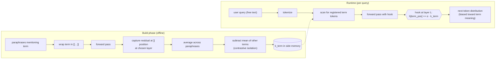

# Mimir-Protocol

Help a frozen language model **understand** new specialist terms — without
**training** it, and without pasting the definition into every prompt.

## Two words we use very precisely

We pick these on purpose because the difference matters:

- **Train** — change the model's actual weights. The model becomes a
  different model afterwards. Slow, expensive, has to be redone when
  anything changes. Fine-tuning and LoRA are forms of training.
- **Understand** — *don't* change the model's weights. Instead, hand
  it a small vector that represents the new term's meaning, and add
  that vector into the model's running thoughts at the right moment.
  The model is byte-for-byte identical before and after; the vector is
  the new knowledge.

This repo is about **understanding**, not training. The model stays
frozen. New terms become small vectors stored in a side dictionary.

## The problem in one paragraph

Modern LLMs are trained on huge amounts of public text, so they know
common words and concepts. But they don't know *your* internal jargon —
team names, product names, made-up engineering terms, anything that
isn't on the public internet. The standard fixes are expensive:
**train** the whole model (slow, costly, has to be redone every time
something changes), or stuff the definition into every prompt (RAG —
works but burns tokens and limits context).

This repo explores a third option: **build a small vector of numbers
that represents what the term means, and add it directly into the
model's internal "thoughts" whenever the term shows up.** The model
doesn't get trained. No definition gets stuffed into the prompt. The
vector does the work — the model now *understands* the term.

## A simple analogy

Think of the model as a person reading a sentence aloud. When they hit
a word they don't know, they pause and stumble. RAG is "writing a
glossary at the top of every page." Fine-tuning is "sending them back
to school for a year." This project is **whispering the meaning in
their ear right as they read the word** — no school, no glossary,
just a quiet correction at the right moment.

## A concrete example

Imagine your team has a system called "Balance Publisher" that connects
to a crypto exchange and reports balances. The model has never heard of
it. Without help, it guesses based on the words: "Balance Publisher
sounds like a financial newsletter."

With Mimir-Protocol, we (a) build a meaning-vector for "Balance
Publisher" once, then (b) at runtime, when a user asks anything
mentioning the term, we add that vector into the model's processing.
The model now *understands* Balance Publisher — without ever being
trained on it.

```
User: "Explain Balance Publisher to a junior engineer joining the trading team."

Without help (Qwen 2.5 0.5B):
  "Balance Publisher is a software tool that helps you manage your
   financial transactions, track expenses, income, and savings…"

With Mimir-Protocol injection at the term position:
  "Balance Publisher is a software tool used by traders to manage
   their trading positions… real-time updates on positions, order
   book, market data, custom strategies…"
```

Same model. No training. No definition in the prompt. The vector did
the steering.

## Final findings — read this first

The full project conclusions, written for non-ML readers, live in
[`CONCLUSIONS.md`](CONCLUSIONS.md). Short version:

- **Single-vector residual injection (the original technique)** works
  as a *steering* tool: biasing the model's output toward a
  registered concept on operational, conditional, and comparative
  queries. It does **not** override "what is X?" on common-word
  compound names — that ceiling was the original closing finding.
- **Three new mechanisms (added 2026-04-28) move the ceiling** for
  axioms with distinct technical vocabulary:
  - *Decode-time logit biasing* — add α·(W_U·v) to next-token logits
    every step. At α=0.4 on Qwen 1.5B, "What is a Balance Publisher?"
    → "a service that publishes balance information for a trading
    exchange" (first clean override of the lexical compound).
  - *Multi-layer decode residual injection* — keep residual hooks at
    L20+L26 active during the decode loop. At α=1.0 → "a service
    that verifies the balance of a cryptocurrency account."
  - *ITI-style head intervention* (Li et al. 2023) — probe per-head
    activations, intervene on the top-K most discriminative heads.
    For Balance Publisher, top heads cluster tightly at L20-21.
    Different geometry of win (DeFi/distributed-protocol).
  - *Blends* — ITI + logit bias compounds cleanly: "Define Balance
    Publisher" → "decentralized exchange protocol... high
    throughput and low latency."
- **Hard limit confirmed.** For axiom names whose surface form
  exactly matches a high-frequency pretraining template
  ("shoe_town" matches "What is a [place]? A X is a place where..."),
  every mechanism + every blend fails to override the place-template
  prior on direct definition queries. Robust negative result across
  three independent geometries.

[`THINGS_TO_TRY.md`](THINGS_TO_TRY.md) lists the priority-ordered
mechanisms tested in the late-stage push.

The project's mechanism log of every approach tried and rejected lives
in [`FAILED_IDEAS.md`](FAILED_IDEAS.md).

## Status (honest)

- The math works: meaning-vectors are real, distinct from each other,
  and combine sensibly when added together.
- Visible behavior shifts on a small model (0.5B parameters) are clean
  on most prompts.
- On a slightly bigger model (1.5B), the vectors are still measurably
  correct but the visible-text shifts are smaller and patchier — the
  model's existing priors push back harder.
- We also tested adding a small **trained** module ("LoRA") on top of
  understanding, to see if it would amplify the effect. In our setup
  it didn't help once plain injection was already working. Skipped for
  now — but worth noting it's the only piece of this project that
  involves training.

The technique is most useful right now for **detection / selectivity**
("is the user talking about Balance Publisher or something else?") and
for **biasing generation** on small models. With the late-stage
mechanisms (decode-time logit bias, multi-layer decode injection,
ITI head intervention, blended), production-grade override of strong
priors **does** work on Qwen 1.5B for axioms with distinct technical
vocabulary — and fails cleanly for axioms whose surface form maps
onto a high-frequency pretraining template.

## Try it

You'll need [uv](https://github.com/astral-sh/uv) (Python package
manager) and a Mac with Apple Silicon (M1/M2/M3) — or any machine with
~8 GB of free RAM and a GPU.

```bash
uv sync                 # install dependencies

# Run the axiom battery: builds vectors for several axiom types and
# probes each with relevant prompts (Qwen 2.5 0.5B):
PYTHONPATH=src uv run python -m marker.run_axiom_battery \
  --model-name Qwen/Qwen2.5-0.5B --layer 17

# Compositional pair (coastal_shoegaze + dream_pop_vocals):
PYTHONPATH=src uv run python -m marker.run_music_composition

# Auto-tune α per axiom from held-out paraphrase loss:
PYTHONPATH=src uv run python -m marker.run_alpha_autotune

# Late-stage mechanisms (the ones that broke the "what is X?" ceiling):
PYTHONPATH=src uv run python -m marker.run_logit_bias_decode --axiom bp
PYTHONPATH=src uv run python -m marker.run_multilayer_decode_inject --axiom bp
PYTHONPATH=src uv run python -m marker.run_iti_intervention --axiom bp

# Blended runs (ITI + logit bias is the production pick):
PYTHONPATH=src uv run python -m marker.run_blends
```

The first run downloads the model (~1 GB). Each prompt is generated
several times (different α levels) and printed side-by-side.

Tests: `PYTHONPATH=src uv run pytest`.

## How it works (slightly more detail)

There are two phases. **Build phase** runs once per term, offline. It
creates a meaning-vector. **Runtime phase** runs on every user query.
It injects the vector while the model is processing.

### Build phase (one-time, per term)

1. Collect ~30 example sentences that use the term in different
   contexts ("Balance Publisher polls the exchange every 250ms",
   "Engineers monitor Balance Publisher latency", etc.).
2. For each sentence, wrap the term in markers (`[[Balance Publisher]]`)
   so we know exactly where it sits.
3. Run each sentence through the model. At a chosen layer (a chosen
   spot in the model's processing pipeline), record the model's
   internal state right at the closing marker.
4. Average all those states. That average is the term's raw meaning-vector.
5. Subtract a baseline ("what does the model do at this position for an
   *average* term?") so we keep only what's distinctive about this term.

### Runtime phase (per user query)

1. User sends a question in plain text. No markers, no glossary.
2. We tokenize it and scan for any registered term ("Balance Publisher",
   "flurgen", whatever's in our side-memory).
3. As the model processes the input, a small hook fires at the chosen
   layer: at the position of the term's tokens, it adds α·v to the
   model's internal state — where v is the meaning-vector and α is a
   knob that controls strength.
4. The model continues processing as normal. Its next-token predictions
   are now nudged toward the registered meaning.

That's it. The base model is never modified. The "memory" of all your
custom terms is just a dictionary `{term_name: vector}`.

## How it works (the technical version)

For mech-interp readers comfortable with the jargon. Skip if you read
the previous section already.



The contrastive-isolation step is load-bearing. Raw averaged residuals
across paraphrases of different terms are ~0.97 cosine-similar — they
all share an "axiom-anchored term in prose" direction. Subtracting the
mean of other terms' raw keys drops cosine to near-zero between
distinct terms while preserving each term's distinctive direction.
This is what makes injection concept-selective rather than producing a
generic perturbation.

Selectivity matrix on Qwen 1.5B layer 20, contrastive injection α=20:

```
                 inject_jotp   inject_eiffel   inject_photo   random
prompt: jotp     +0.020 ◀     -0.018          +0.002         -0.002
prompt: eiffel   -0.049        +0.049 ◀       -0.021         +0.005
prompt: photo    -0.017        -0.009          +0.019 ◀      +0.010
```

Diagonal positive, off-diagonal negative, random near-zero. Standard
concept-selective binding signature in nats of log-prob shift.

## Glossary (jargon you'll see)

- **LLM / language model** — the AI you're talking to (Qwen, GPT,
  Claude, etc.). Predicts the next word given the previous words.
- **Token** — chunk of text the model processes (roughly a word or
  subword piece).
- **Layer** — one stage in the model's pipeline. Models have ~24-80
  layers; we pick one in the upper-middle (e.g. layer 17 of 24, or
  layer 20 of 28).
- **Residual stream / hidden state** — the running vector of numbers
  flowing through the model's layers, updated by each layer. Think of
  it as the model's "current thought" at each position.
- **Hook** — a function attached to a layer that lets us read or
  modify what flows through.
- **LoRA** — a small set of extra **trained** weights bolted onto a
  frozen base model. Cheap way to give the model new behaviour without
  training the whole thing from scratch. Still counts as training,
  just a small amount of it. We tested it; didn't help our setup.
- **Understand vs train** — see the section at the top. *Understand*
  = inject a meaning-vector into a frozen model (this project's main
  technique). *Train* = change weights (LoRA, fine-tuning, pretraining).
- **RAG** — retrieval-augmented generation. Stuff the relevant
  reference text into the prompt so the model can read it. The
  alternative this project explores avoiding.
- **α (alpha)** — the strength knob for injection. Higher α = bigger
  push toward the registered meaning. Too high overwhelms the model;
  too low doesn't move the output.
- **Contrastive isolation** — subtracting a baseline so each term's
  vector is *distinct* from other terms' vectors instead of all
  pointing in the same generic direction.

## What this is not

- **Not RAG.** No axiom definition appears in the prompt. The vector
  carries the meaning.
- **Not training.** Base model is frozen. No weights change. Per-term
  cost is one small numpy array.
- **Not full WISE.** WISE (a paper from 2024) has additional pieces
  we haven't implemented: a learned routing classifier, weight-side
  memory. Mimir-Protocol uses the same core primitive — activation
  injection — without the full machinery.

## Repo layout

```
src/marker/                       # the active line of work
  trigger_inject.py               # runtime: scan tokens, inject at term positions
  run_trigger_demo.py             # the marker-free demo
  build_axiom_vectors.py          # offline build: term -> vector
  train_trigger_lora.py           # the LoRA experiment (parked)
  markers.py, run_extraction.py,  # build-phase utilities
  run_contrastive.py, run_injection.py,
  run_n_axiom.py, run_composition.py, run_hard_t4.py
  run_balance_publisher.py        # realistic-axiom test
  run_flaxum_demo.py              # compositional test (made-up term from known parts)

src/sentinel/                     # earlier LoRA-only fallback (kept for comparison)
src/poc/                          # original GPT-2 attempt (preserved, falsified)

data/                             # paraphrases for each axiom + sentinel training data
docs/                             # technique writeups, deployment runbook
tests/                            # mechanical invariants (TDD)
```

## What's next

- Larger model (Qwen 7B or up) once disk/memory allows — visible-text
  shifts should clean up on stronger priors.
- More axioms in the side memory; characterise how the technique
  behaves when many terms are registered at once.
- Integration with the symbolic side (Mimir, separate repo) so axioms
  flow from a validated source-of-truth into vectors automatically.
