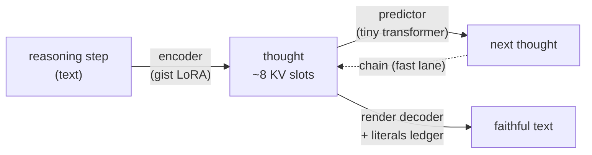
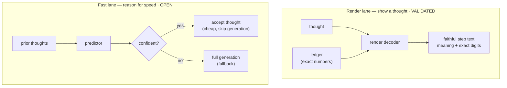

# Mimir-Protocol

**Give a frozen LLM the ability to understand things it was never trained on —
without modifying its weights, without putting definitions in every prompt,
and without an external retrieval step at query time.**

LLMs only know what was in their training data. Anything novel, anything
post-cutoff, anything specialised — the model is blind to it. The standard
answers are fine-tuning (modify the weights, slow) or RAG (paste definitions
into every prompt, eats context).

This repo explores a third path: **hybrid MLP + frozen KV injection**. For
each new concept, we train a small set of two-layer networks ("patches") that
fire whenever the concept's term appears in a prompt, and we compute a frozen
KV cache of the concept's description that gets injected at every forward pass.
The patches modify the model's internal residual stream at the term position for
query-conditional routing; the KV cache lets the model attend directly to
description tokens during decode for stable retrieval.

The model has *understood* something it was never trained on.

> **Two research threads live in this repo.** The sections above and below
> describe the original **knowledge-injection** work (teach a frozen model a
> new fact). The section immediately following documents a newer, related
> thread — **latent thought-prediction**: compressing *reasoning itself* into
> a handful of vectors, then predicting and rendering those thoughts. They
> share the frozen-KV-injection mechanism ("Mimir").

## Latent thought-prediction (active, 2026-07)

A different question: instead of injecting *knowledge*, can we compress a
model's own **reasoning** into a few vectors — a "thought" — then **predict**
the next thought and **render** any thought back to text? The bet is
memory + speed: a reasoning step's meaning survives in ~2-8 vectors (10-30×
smaller than its tokens), and the *sequence* of thoughts is partly predictable
by a model ~100× smaller than the base LLM.

Everything runs on a **frozen** base model (Qwen2.5-7B). Only small adapters
(LoRA) and a tiny predictor are trained.

### The pieces



- **Encoder** — squeezes a sentence/step into ~8 key–value slots (a "thought").
- **Predictor** — a small model that guesses the *next* thought from prior ones.
- **Render decoder** — turns a thought back into its exact text, on demand.
- **Literals ledger** — the exact numbers/names kept verbatim beside the thought
  (compression is lossy on precise digits; the ledger keeps them deterministic).

### Two lanes



- **Render lane** (thought → text): validated. A frozen model's thought
  reconstructs to faithful, exactly-correct text.
- **Fast lane** (chain thoughts for speed): open. Naive chaining fails (a wrong
  thought misleads, and the predictor is right ~30% of the time), so the design
  is *adaptive skipping* — accept confident predictions, fall back to full
  generation otherwise. Gated on a cheap "does confidence track correctness"
  probe before any build.

### Results so far (frozen Qwen2.5-7B)

| stage | what it measures | result |
|---|---|---|
| Encoder | thought carries the step's meaning (`gap_closed`, 1.0 = as good as full text) | **0.88** on reasoning; 0.89 on prose |
| Vector budget (k-sweep) | meaning kept vs #slots (vs topic-only floor 0.63) | k=1 → 0.79, k=2 → 0.84, k=4 → 0.86, k=8 → 0.88, k=16 → ~0.88 (saturates) |
| Predictor | picks the true next thought vs same-problem decoys (within-doc) | **~2× chance** (top-1 0.30 vs 0.16); true thought in top-5 ~89% |
| Render | reconstruct a step from its thought (token-F1, fresh unmemorized text) | **0.93** (median = exact) |
| Render + ledger | + exact-number recall | F1 **0.99**, numbers **100%** (fresh) / 96% (real math) |

**Status:** encoder ✅ · render + ledger ✅ (on-demand thought→text is a solved,
validated capability) · predictor ✅ (real but modest) · fast-lane latent
chaining ⬜ (design done, unproven — the one open pillar).

Design and full experiment log: `STAGE2_PLAN.md`, `FASTLANE_PLAN.md`,
`LATENT_PLAN.md`.

## What it does

Given a description like:

> *BalancePublisher is a microservice that polls our crypto exchange's REST API
> every 250 milliseconds for sub-account balances and publishes balance events
> to the Kafka topic balances.raw. BalancePublisher has no upstream
> dependencies.*

After ~8 minutes of training on A100:

```
Q: How often does BalancePublisher poll?
A: Every 250 milliseconds.                           ← correct

Q: What Kafka topic does BalancePublisher publish to?
A: To the Kafka topic balances.raw.                  ← correct

Q: What programming language is BalancePublisher written in?
A: The description doesn't specify what programming  ← correct (boundary)
   language BalancePublisher uses.

Q: Tell me about BalancePublisher.
A: BalancePublisher is a microservice that polls our  ← correct (overview)
   crypto exchange's REST API every 250 milliseconds...
```

Same model, byte-for-byte unchanged weights. No description text in the prompt.

## Current results (v10, Qwen 2.5-32B, 2026-05)

> **⚠ Results below are invalid pending re-run.** The v10 training set
> (`SUPPLEMENTAL_QA`) contained five HELDOUT questions verbatim — they were
> added as gap-fills after analysing run results, which means the HELDOUT
> scores measured memorization, not generalization. The training set has been
> decontaminated (enforced by `tests/test_heldout_leakage.py`) and the demo
> now also prints a `[K kv-only]` ablation (description KV with the MLP hooks
> disabled) to isolate what the trained MLP actually contributes. Numbers
> will be updated after the next full run.

**32/32** across TRAIN / HELDOUT / BOUNDARY / TELL_ME for both BalancePublisher
and FluxomService test axioms:

| Category | Score | What's tested |
|---|---|---|
| TRAIN | 5/5 + 4/4 | Exact training questions |
| HELDOUT | 7/7 + 6/6 | Unseen paraphrases of the same questions |
| BOUNDARY | 3/3 + 3/3 | Out-of-scope questions (must decline) |
| TELL_ME | 2/2 + 2/2 | Open description requests |

**Multi-axiom isolation**: with both axioms loaded simultaneously, each fires
independently at its own term position. 4/4 isolation probes correct; 2/2
boundary probes correct. No interference.

**CoT**: no longer degrades — KV injection provides stable retrieval during
decode regardless of generation prefix.

**Cross-axiom comparison**: now works. "BalancePublisher polls more frequently"
correctly resolved. ✓

**Multi-turn chat**: 4/4 turns correct including follow-up questions that don't
re-mention the term. ✓

**Composite axioms / hierarchy**: 5/5 — inherited facts correctly answered
across 2 levels of dependency (DaemonProcess → ServiceProcess → MeshPublisher).
✓

**Skill injection**: two axioms working end-to-end — InternalBus (fictional
event-bus DSL) and ilp_for (real C++ macro DSL). 4/4 novel-probe correct for
ilp_for including correct terminator selection and LoopType enum choice. ✓

**KV compression**: `KVCompressor` (~340K params, trained once) reduces KV from
12-15 MB to ~1 MB per axiom at N=4 virtual tokens per layer. Zero accuracy loss
on spot checks. ✓

## How it works

For each new concept ("axiom"), the system maintains two components:

**1. `SmallMLP` at three layers (25%, 50%, 75% of model depth):**

```
hidden (5120) → r (4–64) → hidden (5120)   GELU activation
                                            r=4 for facts, r=64 for skills
```

Fires at the term's token position during prefill. With `skill_mode=True`, fires
at every decode step too — continuously steering generation toward a procedural
pattern. Skill firing is triggered by the term appearing in the prompt (e.g.
`"using InternalBus"`); without it, no skill fires and no bleed occurs. The MLP reads the current
residual — which by mid-layers has already integrated the question context via
attention — and adds a learned offset. This provides query-conditional routing:
the same term in different question contexts produces different outputs.

**2. Frozen KV cache of the axiom's description (`AxiomKV`):**

Computed once at registration time via `compute_axiom_kv`. Optional
`KVCompressor` (~340K params, trained once on existing axioms) mean-pools K and
V across the sequence, passes through a shared MLP with layer embedding, and
produces N compressed K/V tokens per layer — reducing per-axiom KV from 12-15 MB
to ~1 MB at N=4 with no accuracy loss. Enable with `--compress-kv`.

The description is prefixed with `"About {term}:\n"` before encoding, so
merged multi-axiom KVs have clear label boundaries. At every forward pass the
KV is appended to `past_key_values`, making the description tokens directly
attendable during decode. This fixes the passive-retrieval problem that caused
CoT degradation.

Honest framing: injecting the description's frozen KV is attention-equivalent
to having the description text at the start of the prompt — it occupies the
same sequence positions and is attended to the same way. The win over plain
RAG is that the prefill is computed once at registration (and compressible
11-15x), not re-encoded per query, plus the trained MLP for routing/boundary
behaviour. It is not "knowledge without context cost".

```
Prompt:  "Q: How often does BalancePublisher poll?\nA:"

Prefill:
  [About BalancePublisher:\n ...]  ← frozen KV, prepended
  ...  [Balance] [Publisher] [poll?]  [A:]
            ↑         ↑
            MLP hooks fire at layers 16, 32, 48
            MLP_L(residual) → offset added

Decode:  attends to both description KV tokens AND
         injected [Balance][Publisher] K/V → "Every 250 milliseconds."
```

**Training (~8 min on A100):**

1. Use the frozen description KV as teacher context. Ask the teacher to
   generate 30 Q+A pairs about the description (~1-2 min synthetic Q+A).
2. Add hand-written Q+A from known facts, overview examples ("Tell me about
   X" → description), and boundary examples ("The description doesn't
   specify...").
3. Train the MLP weights on these pairs. At each step, a hook fires at the
   term's token position at each chosen layer; loss backprops into MLP weights
   only. For skill axioms, hooks also fire at answer token positions to teach
   the MLP to steer generation throughout decode. Compute and store the
   `AxiomKV` alongside the MLP.

**Inference:**

1. Load the axiom: install MLP hooks + attach the frozen `AxiomKV`.
2. User asks any question containing the term.
3. During prefill: description KV is prepended; MLP hooks fire at the term
   position at layers 16, 32, 48 and add learned offsets.
4. Decode runs normally. The model attends to description tokens (via KV) and
   to the injected term positions (via MLP-modified K/V) to generate the answer.

Layer-by-layer view of the prefill:

```
Layer 0  ──────────────────────────────────────────────────────────────
Layer 1  ──────────────────────────────────────────────────────────────
...
Layer 16 ──── hook fires ──▶ MLP_16(residual at term pos) + offset ───
...
Layer 32 ──── hook fires ──▶ MLP_32(residual at term pos) + offset ───
...
Layer 48 ──── hook fires ──▶ MLP_48(residual at term pos) + offset ───
...
Layer 63 ──────────────────────────────────────────────────────────────

After prefill: description KV is directly attendable; K/V at the term
positions carries the query-conditional routing offsets. Decode runs
without hooks.
```

**Multi-axiom:** install all axiom hooks before the forward pass. Each fires
only at its own term's positions. Prepend all loaded `AxiomKV`s to
`past_key_values`. Different terms → different positions → no interference.

```
"Q: How often does BalancePublisher poll? What format does FluxomService output?\nA:"

  [About BalancePublisher:\n ...] [About FluxomService:\n ...]  ← frozen KVs
  [Balance][Publisher]          [Fluxom][Service]
        ↑                              ↑
  BP hooks fire                  FS hooks fire
  at layers 16,32,48             at layers 16,32,48
  (independently)                (independently)

Decode attends to BP description + BP positions for BP questions,
       attends to FS description + FS positions for FS questions.
```

## Why query-conditional routing matters

Unlike static vector injection, the MLP reads the *current residual at the
term position*, which by mid-layers has integrated the question context via
attention. The same term in different question contexts produces a different
residual → different MLP output → different fact retrieved:

```
"How often does BalancePublisher poll?"
  residual at [BalancePublisher] ≈ identity(BP) + "how often / frequency" context
  MLP_32 sees this → emits offset toward "250 milliseconds"

"What does BalancePublisher publish?"
  residual at [BalancePublisher] ≈ identity(BP) + "publish / output" context
  MLP_32 sees this → emits offset toward "balance events to Kafka"
```

The MLP learns to route different question shapes to different facts. Static
approaches (single trained vector, L0 soft prompt) can't do this — they emit
the same offset regardless of question context.

The frozen KV cache handles the retrieval side: the model can always attend
directly to the description tokens, so decode-time reasoning (CoT, comparisons)
is grounded.

## Multi-turn chat

`AxiomSession` manages multi-turn conversations over N axioms:

- Starts with an empty `past_key_values`.
- On the first turn a term appears, that axiom's `AxiomKV` is appended to the
  session's `past_key_values` tail. The KV persists across all subsequent turns.
- Follow-up questions that don't re-mention the term still retrieve correctly —
  the description tokens are already in the KV.
- MLP hooks still fire per-turn at term positions for query-conditional routing.
- Only mentioned axioms ever get injected — scales to large axiom registries.

```
Turn 1: "What does BalancePublisher publish?"
  → BP KV injected into session. Answer: "balance events to Kafka"

Turn 2: "How often does it poll?"          ← no term mention
  → BP KV still in session. Answer: "Every 250 milliseconds." ✓

Turn 3: "Tell me about FluxomService."
  → FS KV injected. Answer: correct overview ✓

Turn 4: "Which polls faster?"
  → Both KVs in session. Answer: "BalancePublisher polls more frequently." ✓
```

## Composite axioms

`AxiomMLP` supports a `dependencies: list[str]` field. When a term is first
mentioned in a session, all transitive dependencies are activated and their KVs
injected automatically.

```python
axiom_registry = {
    "DaemonProcess":   AxiomMLP(description="...", dependencies=[]),
    "ServiceProcess":  AxiomMLP(description="...", dependencies=["DaemonProcess"]),
    "MeshPublisher":   AxiomMLP(description="...", dependencies=["ServiceProcess"]),
}
```

Asking about `MeshPublisher` automatically activates `ServiceProcess` and
`DaemonProcess`. Questions about inherited behavior (restart policy, log
location, health endpoint, metrics cadence) answer correctly without any
explicit mention of the parent terms.

Tested with a 3-level hierarchy: **5/5** inherited-fact probes correct. ✓

## Per-axiom cost

| Item | Value |
|---|---|
| Training time | ~8 min on A100 (~6 min training + 1-2 min synthetic Q+A) |
| KV computation | once at registration |
| Inference overhead | one extra forward hook per chosen layer per forward pass |
| Weights changed | none |
| Description text in prompt | none |

**r sweep (BalancePublisher):** r=4, 8, 16, 32 all give identical correct answers.
r=4 is as good as r=32 for fact axioms — KV handles retrieval, MLP does routing.
r=64 recommended for skills (procedural generation needs more capacity).

| Component | Full | Compressed |
|---|---|---|
| MLP (r=4 facts) | 0.5 MB | 0.5 MB |
| MLP (r=64 skills) | 7.5 MB | 7.5 MB |
| KV | 12-15 MB | — |
| KV (N=4 compressed) | — | 1.0 MB |
| **Fact axiom total** | **~13 MB** | **~1.5 MB** |

## Why this matters

| | RAG | Fine-tuning | **Mimir-Protocol** |
|---|---|---|---|
| Adds description tokens to context? | yes (re-encoded per query) | no | yes (KV cached once, compressible 11-15x) |
| Changes model weights? | no | **yes** | no |
| Per-concept registration cost | free (store text) | hours of GPU | **~8 min** |
| Works for post-cutoff knowledge? | yes | yes | yes |
| Scales to many concepts? | context-window bound | retrain time bound | context-window bound (only mentioned axioms injected) |
| Boundary discipline (decline out-of-scope)? | depends on prompt | yes | **yes** (trained MLP) |
| Multi-turn without re-injecting? | no | n/a | **yes** (KV persists in session) |
| Composite/hierarchical concepts? | manual doc linking | no | **yes** (dependency graph) |

The strategic shape: a frozen base model plus a cheap, hot-loadable layer of
new concepts, no weight changes. New understanding is added in minutes, not
hours. The model's knowledge boundary moves from "what was in the training set"
to "what we can describe in a paragraph and register".

## What's in scope vs out of scope

**Works:**
- Factual Q+A about a described entity (what does X do, what are X's parameters)
- Boundary discipline (declining questions not covered by the description)
- Overview generation ("Tell me about X")
- Multi-axiom sessions (N axioms simultaneously, each fires at its own term)
- Multi-turn chat (follow-up questions without re-mentioning the term)
- Cross-axiom comparison ("which polls faster?") via KV-grounded decode
- Composite/hierarchical axioms (inherited facts across dependency chains)
- Code-entity axioms (function signatures, API specs — factual Q+A about the code)
- CoT prompting (works with KV injection; was broken before)
- Skill injection via `skill_mode=True` (API patterns, output format rules, DSL usage)
  — triggered by the term in the prompt, no bleed without it
- KV compression (11-15x, `--compress-kv`, zero accuracy loss)

**Doesn't work:**
- RLHF/instruct models — base models are the reliable target
- Sliding-window attention (Gemma 4) — most layers don't reach the term position

## Two words we use precisely

- **Train** — change the model's weights. Fine-tuning, LoRA, full retraining.
  The model is byte-for-byte *different* afterwards.
- **Understand** — don't change weights. Train small per-axiom MLP patches that
  fire at inference time, and compute a frozen KV cache of the description. The
  base model is byte-for-byte *identical*; the patches and KV carry the new
  knowledge.

## Try it

```bash
uv sync

# Run the full MLP axiom demo (BalancePublisher + FluxomService) on Modal:
modal run modal_blends.py::axiom_mlp_demo

# Proof-of-concept on a fictional axiom ("Glorbox"), local or Modal:
PYTHONPATH=src uv run python -m marker.run_axiom_mlp_mini   # local (1.5B)
modal run modal_blends.py::axiom_mlp                         # Modal (32B)
```

## Repo layout

```
src/marker/
  run_axiom_mlp_demo.py     # main demo: trains MLP + computes AxiomKV per axiom,
                            # full probe suite (TRAIN/HELDOUT/BOUNDARY/TELL_ME +
                            # multi-axiom + cross-axiom + multi-turn + hierarchy)
  run_axiom_mlp_mini.py     # minimal local test on fictional "Glorbox" axiom

  prefix_tuning.py          # full KV prefix approach (still works, used as
                            # teacher to generate synthetic Q+A)
  axiom_registry.py         # test axioms with descriptions and Q+A
  soft_prompt*.py           # earlier soft-prompt approaches (v5-v9)
  soft_prompt_slots.py      # v9: slot-assigned soft prompts
  run_soft_prompt_*_demo.py # v5-v9 demo scripts

modal_blends.py             # Modal entrypoints for all cloud runs
tests/                      # mechanical invariants
CONCLUSIONS.md              # full project journal
FAILED_IDEAS.md             # documented dead ends
THINGS_TO_TRY.md            # parked ideas
```

## Related work

- **Prefix tuning** (Li & Liang 2021): trained prefix K/V at every layer —
  same structural idea, trained not captured.
- **ROME / MEMIT** (Meng et al. 2022): targeted MLP weight edits. Modifies
  weights; hard ceiling ~1000 edits before interference.
- **Doc-to-LoRA / Text-to-LoRA** (Sakana AI, 2025-26): hypernetwork produces
  LoRA weights from a description. Right approach for *skills*; Mimir handles
  *facts* without weight changes.
- **RAG**: paste retrieved docs into the prompt. Dominant production approach
  today; the alternative this repo avoids.

## License

See [LICENSE](LICENSE).
