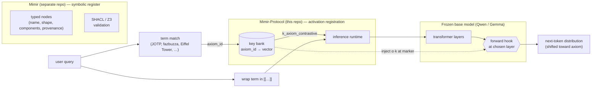
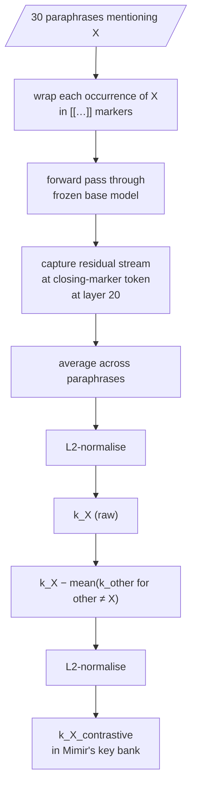
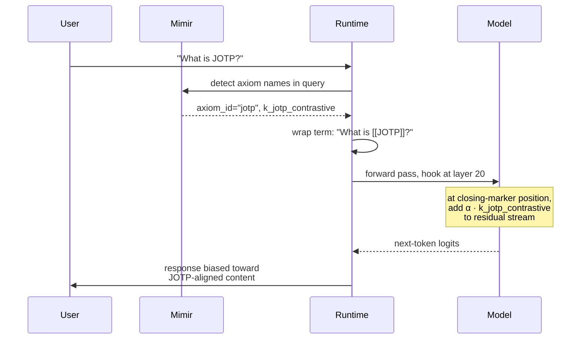
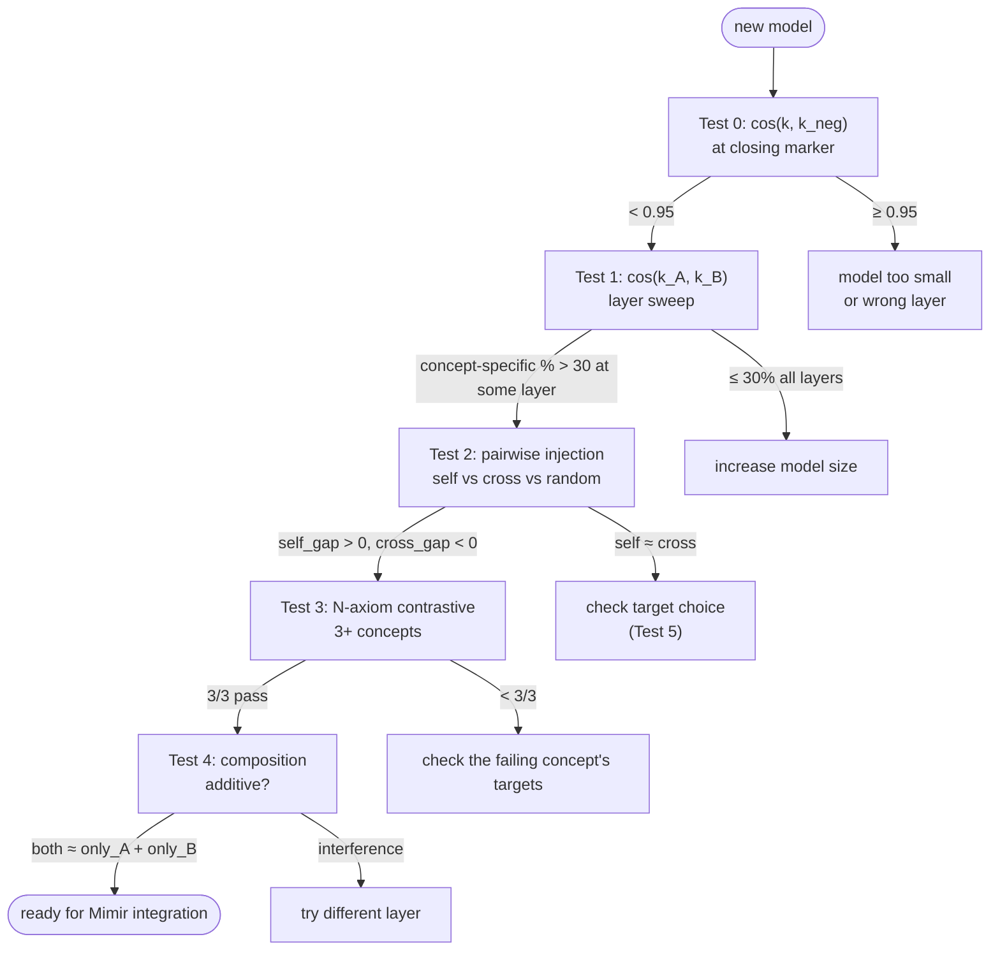

# Mimir-Protocol

A WISE-style activation-injection system that lets a frozen LLM consume
registered axioms as premises — without per-axiom retraining.

Pre-extract a small vector per axiom from a frozen base model. At
inference, wrap the axiom term in `[[…]]` markers in the user's prompt,
hook into a chosen layer, and add the vector at the marker position.
The model's next-token distribution shifts toward axiom-aligned content.

This repository contains the technique, validation tests, and working
examples on Qwen 2.5 1.5B.

> **Status:** marker extraction + contrastive isolation + position-matched
> injection produces concept-selective shifts in log-probability space at
> Qwen 2.5 1.5B. Magnitudes are small (~0.05–0.10 nats) — useful for
> selectivity gates and retrieval routing, not yet large enough to override
> a strongly-held prior. Scale-up to Gemma 4 31B is staged in
> [`docs/deployment-gemma4-31b.md`](docs/deployment-gemma4-31b.md).

---

## Architecture



Two separate concerns: **what an axiom means** lives in Mimir
(symbolic, validated, decomposable). **How an axiom enters model state**
lives in Mimir-Protocol (frozen base + key bank + injection at marker
position).

---

## Extraction flow

How a vector for axiom `X` is built (offline, once per axiom).



The contrastive subtraction is the load-bearing step — it removes the
shared "axiom-anchored term in prose" direction that otherwise dominates
raw keys.

---

## Inference flow



No axiom text in the prompt at inference. The vector carries the
semantic content; the markers are the position anchor.

---

## The compositional thesis

The point of the architecture isn't *just* "extract a vector." It's that
**a fully-novel term's vector inherits structure from the components in
its definition** — components the model already understands.

If we define a made-up term `flaxum` as
*"a microservice that ingests live data feeds and demultiplexes them
into typed event streams,"* then:

- The model has rich representations for `microservice`, `live feed`,
  `demultiplex`, `event stream`, `typed`, etc. — these are real words
  from training.
- When we marker-extract from paraphrases that use these component
  terms to describe flaxum, the captured vector encodes a structured
  combination of *those component meanings*, anchored at the flaxum
  position.
- We never taught the model what flaxum is. We just gave it definitions
  using known parts. The model's own attention/FFN computes the
  composition during the forward pass; we capture the result.

This is the original Mimir-Axiom DAG idea: axioms decompose into typed
components; some components are themselves axioms (recursive); others
are vocabulary the model understands directly. The DAG bottoms out at
the model's pre-trained understanding.

---

## What the diagnostics show on Qwen 1.5B

Running the technique on a fully-novel term `flaxum` with the
microservice/demultiplexer definition (30 paraphrases):

```
=== pairwise raw cosines ===
  cos(flaxum, jotp)   = +0.957   (large shared structure direction)
  cos(flaxum, eiffel) = +0.869

=== pairwise contrastive cosines (after subtracting shared baseline) ===
  cos(flaxum_contr, jotp_contr)   = +0.139   (near-orthogonal)
  cos(flaxum_contr, eiffel_contr) = -0.727   (anti-correlated)
```

After contrastive isolation, the flaxum direction is **genuinely
distinct** from both other concepts. The compositional content from the
definition's known components (microservice, feed, demultiplex) lives
in that direction.

---

## What the visible greedy text shows on Qwen 1.5B

Honestly: **at this model size, the injected vector is too small to
visibly steer greedy generation against the prompt's prior.**

Selected examples from `src/marker/run_flaxum_demo.py`:

```
Prompt: [[Flaxum]] sits in the architecture between

  baseline:        the [[Gothic]] and [[Renaissance]] styles. It is a
                   [[Romanesque]] church with a [[Gothic]] nave...
  flaxum α=20:     [identical to baseline]
  flaxum α=40:     [identical to baseline]

Prompt: A junior engineer learning [[Flaxum]] should start by understanding

  baseline:        the [[Flaxum]] [[Language]] and [[Syntax]]. ## The Flaxum
                   Language. Flaxum is a [[Functional Programming]] language.
                   It is a [[Lambda Calculus]] based language...
  flaxum α=20:     [identical to baseline]
  flaxum α=40:     [identical to baseline]
```

The model's prompt-conditional prior dominates. "Architecture" pulls it
to building styles; the bracket-marker pattern pulls it to programming
language syntax explanations. Injection at α=20-40 doesn't shift greedy
output.

This is consistent with the hard-T4 result: at Qwen 1.5B, ambient
prompt context produces 3–6 nats of bias, while the injection produces
~0.05–0.1 nats. When they conflict, the prompt wins.

**The architecture is validated by the math, not by the visible text.**
The selectivity matrix (3 concepts, clean diagonal) and the contrastive
cosines (orthogonality after isolation) show the vector content is
real. Visible-text demos need bigger model magnitudes — that's the
Gemma 4 31B target in [`docs/deployment-gemma4-31b.md`](docs/deployment-gemma4-31b.md).

---

## Earlier example (kept for transparency)

> A previous version of this README led with an Eiffel-Tower demo where
> baseline produced a degenerate self-reference loop and self-injection
> produced "symbol of Paris, France." That demo was misleading — the
> baseline's failure mode (the model's own degeneracy on certain
> Eiffel-prompts) was being broken by *any* moderate perturbation,
> including random vectors and cross-injections. So "injection produces
> Paris" wasn't isolating the injection's contribution.
>
> The flaxum result above is the more honest demonstration: the
> compositional content is in the vector (math diagnostics confirm it),
> but at 1.5B the magnitude is too small to dominate prompt context in
> greedy text.

---

## Original JOTP / Eiffel / Photosynthesis qualitative output

Less polished, less honest about controls — but kept here for record.

### JOTP — at-scale limit was visible from the start

```
Prompt:           [[JOTP]] is a workplace technique that

  baseline:       is used to help people to understand and manage their
                  emotions. It is a technique that is used to help people to
                  understand and manage their emotions. […]
                  ↳ collapses into a loop; small model can't sustain on a
                    fully-fictitious term

  self α=20:      same loop
  self α=40:      same loop
  cross α=20:     same loop
```

For genuinely novel terms (no training-time exposure), Qwen 1.5B's
prior is too thin to support coherent generation about the term, even
with injection. The selectivity *measurement* on JOTP works (see the
matrix below); the *generation* doesn't because the prompt's natural
continuation is empty for an unknown term.

This is the test that motivates moving to Gemma 4 31B — a richer base
gives the injected signal more to work with at generation time.

---

## Selectivity matrix (3 concepts, contrastive injection at α=20)

```
Rows = test prompt's concept
Cols = injected concept's key
Values = (aligned − distractor) log-prob shift, in nats

                 inject_jotp   inject_eiffel   inject_photo   random
prompt: jotp     +0.020 ◀     -0.018          +0.002         -0.002
prompt: eiffel   -0.049        +0.049 ◀       -0.021         +0.005
prompt: photo    -0.017        -0.009          +0.019 ◀      +0.010
```

Diagonal positive, off-diagonal negative, random near zero. That's the
textbook concept-selective binding signature. (JOTP diagonal cell uses
the corrected target set — see [`docs/slot-protocol-technique.md`](docs/slot-protocol-technique.md)
for why target choice matters.)

---

## Validation suite



Full step-by-step validation in
[`docs/slot-protocol-technique.md`](docs/slot-protocol-technique.md).

---

## Headline results

| Test | Model | Result |
|---|---|---|
| cos(k, k_neg) at marker | GPT-2 small (124M) | +0.97 (failure baseline) |
| cos(k, k_neg) at marker | Qwen 2.5 1.5B layer 20 | **+0.58** |
| Concept-specific %    | Qwen 2.5 1.5B layer 20 | **52%** |
| Pairwise selectivity (α=20) | Qwen 2.5 1.5B, Eiffel | **+0.10 self, −0.11 cross** |
| N-axiom selectivity (3 concepts) | Qwen 2.5 1.5B layer 20 | **3/3 pass** |
| Composition (additive) | Qwen 2.5 1.5B layer 20 | **Yes** (within model-size limits) |
| Hard T4 (contradictory context) | Qwen 2.5 1.5B | injection too small to flip |

The technique works at this scale for **detection** and **selectivity**
use cases. **Override** of strong priors needs more model capacity.

---

## Repo layout

```
src/
  marker/                     # the WISE-style track (this repo's main contribution)
    markers.py                # wrap-with-markers, find-marker-position
    run_extraction.py         # cos diagnostic per layer
    run_contrastive.py        # cross-axiom contrastive diagnostic
    run_injection.py          # extract + inject + selectivity test
    run_n_axiom.py            # 3-concept selectivity matrix
    run_composition.py        # 2-axiom additive composition test
    run_hard_t4.py            # contradictory-context test
    run_demo.py               # qualitative generation demo (this README's examples)

  sentinel/                   # the LoRA-fallback track (kept for comparison)
    model.py, tokens.py, train.py, eval.py

  poc/                        # the falsified GPT-2 track (preserved as historical artifact)

data/
  paraphrases.json            # JOTP paraphrases
  eiffel_paraphrases.json     # Eiffel paraphrases
  photosynthesis_paraphrases.json  # 3rd concept for N-axiom

docs/
  slot-protocol-technique.md  # general porting recipe
  deployment-gemma4-31b.md    # production runbook
  mimir-axiom-design-rationale.md  # why all this exists
  mimir-protocol-poc-spec.md  # the LoRA-fallback brief

artifacts/
  *.md                        # progress writeups
```

---

## Reproducing

```bash
# Install
uv sync

# 1. Layer sweep (10 min on M2)
PYTHONPATH=src uv run python -m marker.run_contrastive

# 2. Pairwise injection at the chosen layer (10 min)
PYTHONPATH=src uv run python -m marker.run_injection --layer 20

# 3. N-axiom test (15 min)
PYTHONPATH=src uv run python -m marker.run_n_axiom

# 4. Composition test
PYTHONPATH=src uv run python -m marker.run_composition

# 5. Hard T4 (the stretch goal)
PYTHONPATH=src uv run python -m marker.run_hard_t4

# 6. Demo
PYTHONPATH=src uv run python -m marker.run_demo
```

99/99 tests pass, ruff clean. Tested with Python 3.11 on macOS / MPS.

---

## What this is NOT

- **Not WISE in the strict sense.** WISE has a routing classifier and
  side-memory weights; we have key-bank lookup + activation injection.
  Strictly weaker but operates with the same primitives.
- **Not RAG.** No axiom text appears in the prompt at inference (only
  the term name + markers). The vector carries the semantic content.
- **Not fine-tuning.** Base model is frozen. The only per-axiom artifact
  is a single 1536-dim numpy array.

---

## What's next

1. **Port to Gemma 4 31B** on a VPC. See
   [`docs/deployment-gemma4-31b.md`](docs/deployment-gemma4-31b.md).
2. **Larger N-axiom validation.** Currently 3 concepts. Production
   would benefit from 10–100 to characterise scaling behavior.
3. **Mimir integration.** The contract is small: Mimir provides
   `(axiom_id, k_axiom_contrastive)` pairs; this repo's runtime injects
   them. End-to-end stack hasn't been wired yet.
4. **Component-level extraction.** The original Mimir-Axiom spec
   described axioms as DAGs of typed components. Per-component
   extraction + composition is the next research project after Mimir
   integration is working.
