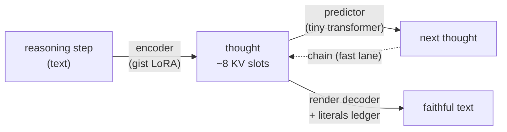
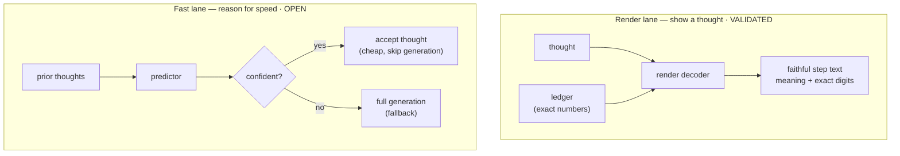

# Latent thought-prediction (active, 2026-07)

> One of two research threads in this repo. See the [top-level README](../README.md)
> for the other (knowledge injection) and the shared frozen-KV-injection mechanism.

A different question from the knowledge-injection thread: instead of injecting
*knowledge*, can we compress a model's own **reasoning** into a few vectors — a
"thought" — then **predict** the next thought and **render** any thought back to
text? The bet is memory + speed: a reasoning step's meaning survives in ~2-8
vectors (10-30× smaller than its tokens), and the *sequence* of thoughts is
partly predictable by a model ~100× smaller than the base LLM.

Everything runs on a **frozen** base model (Qwen2.5-7B). Only small adapters
(LoRA) and a tiny predictor are trained.

## The pieces



- **Encoder** — squeezes a sentence/step into ~8 key–value slots (a "thought").
- **Predictor** — a small model that guesses the *next* thought from prior ones.
  Full breakdown: [predictor-anatomy.md](predictor-anatomy.md).
- **Render decoder** — turns a thought back into its exact text, on demand.
- **Literals ledger** — the exact numbers/names kept verbatim beside the thought
  (compression is lossy on precise digits; the ledger keeps them deterministic).

## Two lanes



- **Render lane** (thought → text): validated. A frozen model's thought
  reconstructs to faithful, exactly-correct text.
- **Fast lane** (chain thoughts for speed): open. Naive chaining fails (a wrong
  thought misleads, and the predictor is right ~30% of the time), so the design
  is *adaptive skipping* — accept confident predictions, fall back to full
  generation otherwise. Gated on a cheap "does confidence track correctness"
  probe before any build.

## Results so far (frozen Qwen2.5-7B)

| stage | what it measures | result |
|---|---|---|
| Encoder | thought carries the step's meaning (`gap_closed`, 1.0 = as good as full text) | **0.88** on reasoning; 0.89 on prose |
| Vector budget (k-sweep) | meaning kept vs #slots (vs topic-only floor 0.63) | k=1 → 0.79, k=2 → 0.84, k=4 → 0.86, k=8 → 0.88, k=16 → ~0.88 (saturates) |
| Predictor | picks the true next thought vs same-problem decoys (within-doc) | **~2× chance** (top-1 0.30 vs 0.16); true thought in top-5 ~89% |
| Render | reconstruct a step from its thought (token-F1, fresh unmemorized text) | **0.93** (median = exact) |
| Render + ledger | + exact-number recall | F1 **0.99**, numbers **100%** (fresh) / 96% (real math) |

**Status:** encoder ✅ · render + ledger ✅ (on-demand thought→text is a solved,
validated capability) · predictor ✅ (real but modest) · fast-lane latent
chaining ⬜ (design done, unproven — the one open pillar).

## Design and full experiment log

- `STAGE2_PLAN.md` — encoder + predictor experiments, k-sweep, render/ledger results.
- `FASTLANE_PLAN.md` — the fast-lane (adaptive-skipping) design and its gating probe.
- `LATENT_PLAN.md` — the overall latent-reasoning plan and open gates.

## Code

```
src/marker/
  gist_model.py     # encoder: text -> thought KV (gist_kv, chain_gist_kv)
  predictor.py      # NextThoughtPredictor + losses/metrics
  render.py         # render decoder + literals ledger
  bridge.py         # predicted thought -> injectable KV (GistBridge; built, untrained)
  run_stage2.py     # encode corpus + train/eval the predictor
  run_render.py     # train the render decoder
```
