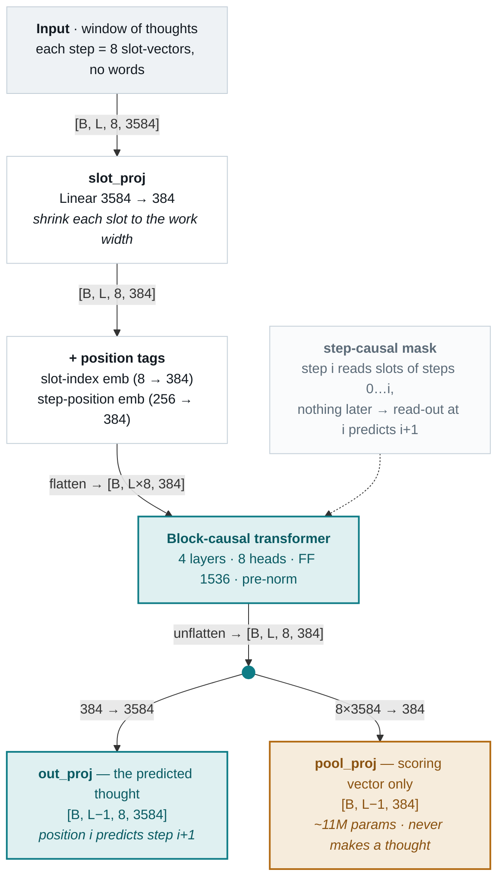

# Anatomy of the next-thought predictor

> Part of the [latent thought-prediction](latent-thought-prediction.md) thread.
> Source: `src/marker/predictor.py`. Trained checkpoint: `stage2_cot_openr1`.

## What it is, in one line

A small transformer (~20M weights) that reads the *thoughts* of the reasoning
steps so far and guesses the *next* thought — before that step's text exists.
A "thought" here is a reasoning step squeezed into 8 vectors (a "gist"); the
predictor never sees words, only these compressed vectors.

It is ~300× smaller than the frozen Qwen2.5-7B it rides on. The bet of the whole
thread is that *predicting the next thought* is easy enough for a model this
small even though *reasoning* is not.

## The job

```
input:   thoughts of steps 1..n     (each = 8 vectors of 3584 numbers)
output:  a guess of step n+1's thought   (8 vectors of 3584 numbers)
```

At every position it predicts the *next* step from everything before it — the
same "predict the next token" idea, lifted from words up to whole reasoning
steps. One forward pass produces a guess at every position at once (step 1
predicts 2, steps 1–2 predict 3, and so on).

## The shapes

A document window is a stack of thoughts: `[L steps, k=8 slots, d=3584]`.
Internally the predictor works in a smaller width `d_model` (384 in the trained
model) and projects back out to 3584 at the end.

```
gists  [B, L, 8, 3584]
   │  slot_proj: 3584 → 384         (shrink each slot vector to work width)
   │  + slot-index embedding         (which of the 8 slots is this?)
   │  + step-position embedding      (which step in the trace?)
   ▼
       [B, L, 8, 384]  ──flatten──►  [B, L*8, 384]   (8 tokens per step)
   │  block-causal transformer, 4 layers, 8 heads
   ▼
       [B, L*8, 384]  ──unflatten──► [B, L, 8, 384]
   │  out_proj: 384 → 3584           (project back to thought space)
   ▼
predicted next thoughts  [B, L-1, 8, 3584]   (position i predicts step i+1)
```

## Anatomy, part by part



The teal path is the thought the model produces; the amber `pool_proj` head is a
scoring-only readout (see below). Tensor shapes ride on the arrows.

- **`slot_proj` (3584 → 384).** Each of the 8 slot vectors is shrunk to the
  working width. All the transformer's thinking happens at 384, not 3584 — that's
  most of why it's cheap.

- **Slot-index embedding (8 entries).** The 8 slots of a thought are not
  interchangeable — slot 1 and slot 8 carry different kinds of information — so
  each slot position gets a learned tag added to it.

- **Step-position embedding (256 entries).** A learned tag for *which step* in
  the trace this is (step 0, 1, 2…). This is the piece that must match between
  training and use: the tags only exist for positions the model was trained on
  (its training window), so at inference we always feed a window-sized slice,
  never a whole 40-step document — beyond the trained range these tags are
  gibberish. (This exact mismatch was a bug caught in the bridge experiments.)

- **The trunk: a block-causal transformer** (4 layers, 8 heads, "norm-first").
  Standard transformer, one twist in the attention mask — see below.

- **`out_proj` (384 → 3584).** Projects the trunk's output back up to full
  thought space. This is the actual prediction — the guessed next thought.

- **`pool_proj` (8*3584 → 384).** A *second*, separate readout used only for
  *scoring/training*, not for producing the thought. It squashes all 8 slots
  into one 384-vector so two thoughts can be compared with a single dot product
  (used by the retrieval metric and the contrastive loss below). It's the
  single biggest weight in the model (~11M of the ~20M).

## The one twist: block-causal attention

A normal language model is *token*-causal: token 5 may look at tokens 0–4.
Here the unit is a *step*, and each step is 8 slots (8 "tokens"). The mask is
**step-causal**: every slot may attend to every slot of any *earlier-or-equal*
step, but nothing from a later step.

```
step 0 (slots 0-7) ── all 8 mutually visible ──┐
step 1 (slots 0-7) ── sees steps 0 and 1 ──────┤   predicting step i+1
step 2 (slots 0-7) ── sees steps 0,1,2 ────────┘   = read out at step i,
                                                     which saw 0..i
```

So "predict step i+1 from steps 0..i" falls straight out of the geometry: read
the trunk's output at step i's slots, which by construction saw exactly steps
0 through i. The 8 slots *within* a step see each other freely (a thought isn't
internally ordered), which is why it's block-causal, not strictly token-causal.
(Code: `build_block_causal_mask`.)

## How it's trained

Two losses at once (`regression_loss` + `info_nce_loss`):

- **Regression (1 − cosine).** Push the predicted thought to point the same
  direction as the true next thought. On its own this loss has a failure mode:
  the safest way to minimize average error is to predict the *bland average* of
  all thoughts (a platitude) — technically close to everything, useful for
  nothing.

- **InfoNCE (contrastive).** The guard against that. In a batch of predictions,
  each one must rank *its own* true next-thought above every *other* thought in
  the batch. A bland average can't win that contest — it looks equally like all
  of them — so this loss forces the prediction to be *specifically* right, not
  generically plausible.

Two health metrics watched during training (`recall_at_k`,
`prediction_diversity`): does the true next-thought land in the prediction's
top-k nearest candidates (signal), and have the predictions collapsed to one
vector (the platitude failure)?

## The trained model (`stage2_cot_openr1`)

| knob | value | meaning |
|---|---|---|
| `d` | 3584 | thought vector width (= Qwen hidden size) |
| `k` | 8 | slots per thought |
| `d_model` | 384 | internal working width |
| `layers` | 4 | transformer blocks |
| `heads` | 8 | attention heads |
| params | ~20M | vs 7B in the base model (~300× smaller) |

## What it can and can't do (measured)

- **Modest but real accuracy.** Its top-1 guess is the true next thought ~30% of
  the time (within-document, vs ~16% chance); the true thought is in its top-5
  ~89% of the time. So it usually knows the *neighborhood*, often not the exact
  point.
- **Its guesses land "near."** Mean cosine 0.665 to the true next thought — same
  general direction, not the same vector.
- **It does not know when it's right.** The confidence probe found no
  inference-time signal that separates its correct guesses from its wrong ones
  (dropout-agreement AUC ≈ 0.50). This is what killed the confidence-gated "fast
  lane" design.
- **But "near" is usable.** When a predicted thought is converted to injectable
  form (the bridge) and fed to the frozen model, it closes 62% of the
  no-context→full-context gap — far above the 28% generic-context floor. See
  [latent-thought-prediction.md](latent-thought-prediction.md).

## The crucial caveat: what it predicts is *not* directly injectable

The predictor outputs a thought as **8 final-layer summary vectors**. But the
frozen model reasons from a thought's **full per-layer key/value cache** (28
layers of it). Those are different objects — the summary is a compact *handle*,
the per-layer KV is the *substance*. Turning a predicted summary back into an
injectable thought needs a second small network (the **bridge**), which the
bridge experiments trained and validated. Without it, a predicted thought is a
number you can score with a ruler but never actually *use*.
